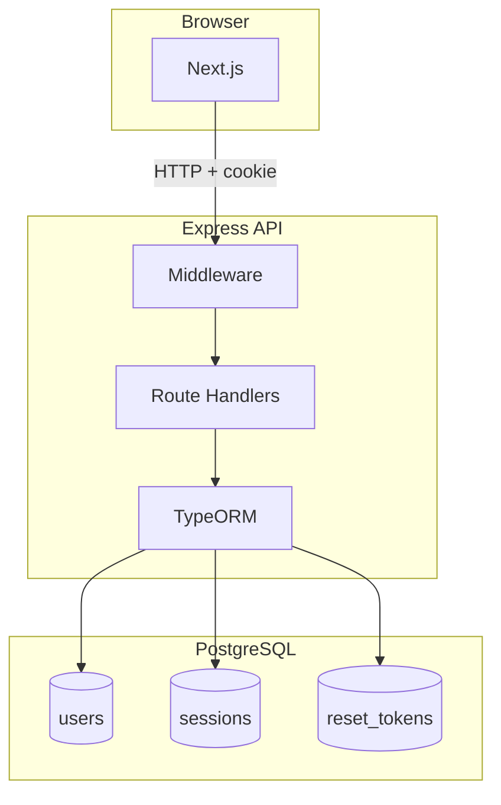

# Architecture Overview

<!-- AI_CONTEXT
This document explains the high-level system architecture.
Key concepts: client-server, session auth, monorepo, Docker networking
Key files: apps/web, apps/api/src/index.ts, packages/shared, docker-compose.yml
IMPORTANT: There is no services layer in the API. All route handlers are defined directly in apps/api/src/index.ts.
Routes: /api/auth/*, /api/me, /healthz, /readyz
Related docs: monorepo-structure, docker-setup, frontend/nextjs-overview, backend/express-overview
-->

App Shell is a three-part system: a frontend the user interacts with in their browser, an API that handles data and business logic, and a database that stores everything. These three pieces run as separate processes — each in its own Docker container — and communicate over a private network.

## The Big Picture

Every request from the browser goes to the API. The API validates the session, runs the appropriate logic, talks to the database through TypeORM, and returns a JSON response. The frontend never touches the database directly.

## How a Request Travels

Here's what actually happens when a logged-in user loads a page:

**1. Browser requests a page from Next.js** at `localhost:3001`. Next.js renders the page and serves it.

**2. The frontend checks if the user is authenticated** by calling `GET /api/me`. This endpoint requires a valid session — if the session cookie is missing or expired, it returns a 401 and the frontend redirects to login.

**3. Each API request carries a session cookie** that the browser sends automatically. The session middleware looks up that cookie in the PostgreSQL sessions table and attaches the corresponding user ID to the request.

**4. The route handler runs** and does its work — querying the database, running validation, whatever the endpoint is responsible for.

**5. TypeORM translates between objects and SQL** so route handlers work with JavaScript objects rather than raw database queries.

**6. The API returns JSON** and the frontend renders the result.

If the session is invalid at step 3, the request is rejected before it ever reaches the route handler. This is the job of the `requireAuth` middleware.

## Key Design Decisions

### Sessions over tokens

Authentication in web apps is usually done one of two ways: **sessions** (the server remembers you) or **tokens** (a cryptographically signed credential you carry around, commonly JWTs). App Shell uses sessions.

With a session, when you log in, the server creates a record in the database and hands you a cookie with a session ID. On every subsequent request, the server looks up that ID, confirms it's still valid, and proceeds. The actual user data never leaves the server.

With a JWT, all the user's information is encoded into a token that gets sent with every request. The server can verify it without a database lookup — but that also means it can't be revoked. If a JWT is stolen or a user is compromised, there's no way to invalidate that token until it naturally expires.

Sessions win for web applications because they can be revoked instantly. App Shell exposes this directly: users can see all their active sessions and kill any of them from the profile page.

### One shared internal network

In development, the three containers (web, api, db) are connected on a private Docker bridge network. The frontend can't reach the database directly — it can only talk to the API. The database port is only exposed to your local machine for convenience (so you can use `./dev.sh db` to inspect it). In production, the database port isn't exposed at all.

This is a basic but important security boundary: your database is never directly reachable from the browser.

### Everything in one repo

Having the frontend and backend in the same repository means type changes propagate automatically. If the `User` type in `packages/shared` gains a new field, TypeScript will tell you immediately where the frontend or backend code needs to catch up — before you ship anything. In separate repos, that kind of mismatch usually surfaces in production.

## Technology Choices

| Layer | Technology | Why |
|-------|-----------|-----|
| Frontend | Next.js 15 | App Router, React 19, file-based routing, built-in optimization |
| Backend | Express | Minimal, flexible, large ecosystem, easy to read |
| Database | PostgreSQL | Reliable, full-featured, excellent TypeORM support |
| ORM | TypeORM | TypeScript-native, handles schema creation, entity relations |
| Monorepo | pnpm + Turborepo | Shared types, parallel builds, intelligent caching |
| Infrastructure | Docker | Consistent environments, simple onboarding, production parity |

Express is deliberately minimal. Unlike heavier frameworks that generate a lot of structure, Express just gives you a way to define routes and middleware. All of App Shell's API routes are defined in a single file (`apps/api/src/index.ts`), which makes the full API easy to read and understand before you start extending it.
