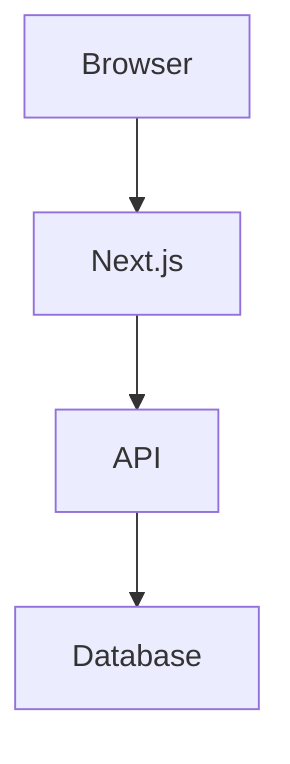

# Documentation Authoring Guide

<!-- AI_CONTEXT
This guide is for AI agents and developers who need to write or modify documentation.
Key files: apps/web/src/content/docs/_config.ts, apps/web/src/components/docs/markdown-renderer.tsx
_config.ts structure: docsConfig array of { title, slug, sections: { title, slug, file }[] }
AI_CONTEXT blocks are hidden from readers but visible to AI agents parsing the markdown.
New theme imports go in theme.css (not globals.css).
Registration file for themes: theme.config.ts (not theme-list.ts).
This document defines the standards for consistent documentation across the project.
-->

This guide covers how to write and modify documentation consistently. It applies to both AI agents and human contributors.

## File Structure

Documentation lives in `apps/web/src/content/docs/` with numbered chapter folders:

```
docs/
├── _config.ts              # Navigation configuration — update when adding pages
├── 01-getting-started/
│   ├── 01-introduction.md
│   ├── 02-quick-start.md
│   └── ...
├── 02-architecture/
└── ...
```

### File Naming

- **Folders**: `XX-chapter-name/` (e.g., `01-getting-started/`, `10-reference/`)
- **Files**: `XX-page-name.md` (e.g., `01-introduction.md`, `03-api-routes.md`)
- Lowercase with hyphens (kebab-case)
- Numbers control ordering in the navigation

## Adding New Documentation

### Step 1: Create the markdown file

```
apps/web/src/content/docs/03-frontend/06-new-topic.md
```

### Step 2: Update `_config.ts`

Add an entry to the `docsConfig` array:

```typescript
{
  title: 'Frontend',
  slug: 'frontend',
  sections: [
    // ... existing sections
    { title: 'New Topic', slug: 'new-topic', file: '03-frontend/06-new-topic.md' },
  ],
},
```

> [!IMPORTANT] The `slug` must be unique within the chapter and URL-safe (lowercase, hyphens only). It becomes part of the URL: `/dashboard/docs/frontend/new-topic`.

## Markdown Formatting

### AI Context Block

Every document should begin with an AI context block immediately after the H1. This block is hidden from readers but is visible to AI agents parsing the file. Use it to document what the file covers, which source files are relevant, and any gotchas that an AI working with the code should know:

```markdown
# Page Title

<!-- AI_CONTEXT
Brief description of what this document covers.
Key files: list relevant source files
IMPORTANT: any facts that are commonly wrong or counter-intuitive
Related docs: list related documentation pages
-->
```

Keep AI_CONTEXT blocks accurate — they propagate into AI context windows and wrong information there causes wrong code suggestions.

### Headings

- **H1 (`#`)**: Document title — one per page, at the very top
- **H2 (`##`)**: Major sections
- **H3 (`###`)**: Subsections
- **H4 (`####`)**: Minor subsections (use sparingly)

### Code Blocks

Always specify the language for syntax highlighting:

````markdown
```typescript
const example = 'TypeScript code';
```

```bash
./dev.sh up
```

```json
{ "key": "value" }
```

```css
[data-theme='name'] { --primary: #2563eb; }
```
````

**Supported languages**: `typescript`, `javascript`, `bash`, `json`, `yaml`, `sql`, `markdown`, `html`, `css`

## Callouts

Use GitHub-style callouts for important information. These render with icons:

```markdown
> [!NOTE] Informational note — neutral context.

> [!TIP] Helpful suggestion or best practice.

> [!WARNING] Caution — something to be careful about.

> [!IMPORTANT] Critical information that must not be missed.
```

**Rendered examples:**

> [!NOTE] This is a note callout.

> [!TIP] This is a tip callout.

> [!WARNING] This is a warning callout.

> [!IMPORTANT] This is an important callout.

## Tables

Standard markdown tables. They render inside themed cards:

```markdown
| Column 1 | Column 2 | Column 3 |
|----------|----------|----------|
| Data     | Data     | Data     |
```

## Links

### Internal Links

Use absolute paths from `/dashboard`:

```markdown
[Quick Start](/dashboard/docs/getting-started/quick-start)
[API Routes](/dashboard/docs/backend/api-routes)
```

### External Links

External links open in a new tab automatically:

```markdown
[Heroicons](https://heroicons.com/)
[TypeORM docs](https://typeorm.io/)
```

## Diagrams

Use Mermaid for diagrams. Wrap in a fenced code block with `mermaid` as the language:

````markdown

````

Mermaid diagrams adapt to light/dark mode automatically.

## Style Guidelines

**Write in second person.** "You can configure..." not "Users can configure..." or "One can configure..."

**Use present tense.** "The hook returns..." not "The hook will return..."

**Keep paragraphs short.** 2–4 sentences. Dense paragraphs are harder to scan.

**Lead with what, explain why.** State what something does before explaining how or why.

**Include code examples for everything technical.** Concepts without examples are hard to act on.

**Link to related pages.** At the end of each section and at the bottom of each page.

## For AI Agents

1. **Read `_config.ts` first** to understand the documentation structure and which files correspond to which URLs
2. **Fact-check against source code** — the placeholder docs are not considered accurate; verify against the actual source files listed in AI_CONTEXT blocks
3. **Read the actual source files** before writing documentation for them
4. **Include AI_CONTEXT blocks** in every document you create or significantly rewrite
5. **Keep AI_CONTEXT accurate** — wrong context blocks are worse than no context blocks
6. **Match the style** of adjacent pages in the same chapter

### When Adding New Features

1. Document the feature in the appropriate chapter
2. Update the API Reference if you added endpoints
3. Update the Component Reference if you added UI components
4. Update the Hook Reference if you added custom hooks
5. Add the page to `_config.ts`
